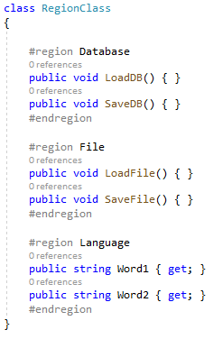
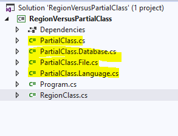
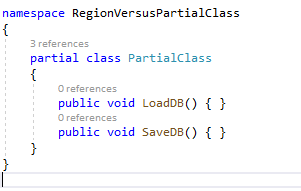

# Regions Alternatives Samples
Sample project to show the alternatives to C# regions

## Regions-vs-Partial-Sample
The basic idea is that if the responsibility of the class can't be split, I prefer to use partial classes.

It makes it easy to find each "group" of methods, it helps with git push because two developers can work in separate files and you can search easily with VS without ReSharper

